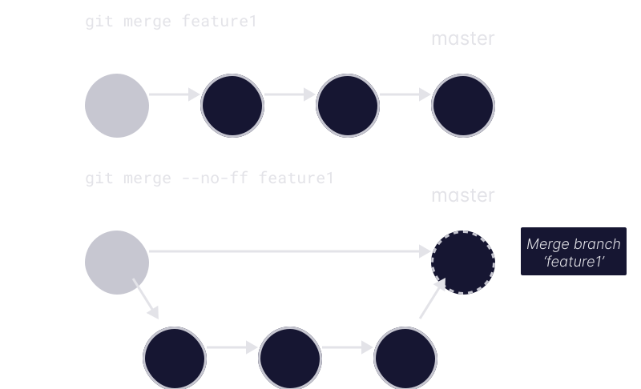

| 标题                       | 标签         |
| -------------------------- | ------------ |
| fastForwardMerge(快进合并) | branch(分支) |

合并分支是使用 Git 时最常见的操作之一。 根据您参与的团队和项目，您可能听说过甚至使用过 Git 合并时的快进模式。 快进模式是 Git 中的默认模式，但 GitHub 基本上会默认覆盖此模式并创建合并提交。

## 快进合并

如上所述，Git 默认是使用快进合并。 它将从正在合并的分支中获取提交，并将它们放置在您要合并到的分支的顶端。 这创建了线性历史，这也是使用快进合并的主要优点。 如果你想在 GitHub 上模拟快进合并，可以使用“Rebase and merge”选项。

## 无快进合并

另一方面，GitHub 默认使用非快进合并。 它将在您要合并到的分支的顶端创建一个合并提交，可以选择在提交消息中引用要合并的分支。 与快进合并相比，这具有更明确地跟踪分支的优点。 如果您想在 Git 终端中获得相同的行为，可以使用 `--no-ff` 标志。

附带说明一下，您可以使用 `git config` 配置默认的 Git 合并行为。 要了解如何执行此操作，您可以查看[相关代码片段](codes/git/disableFastForward.md)。
