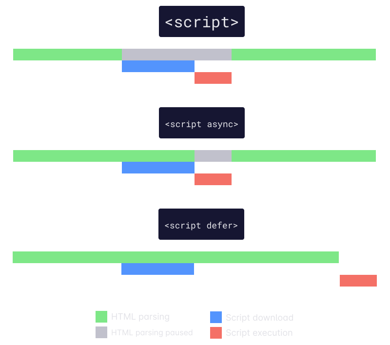

| 标题                                                       | 标签                            |
| ---------------------------------------------------------- | ------------------------------- |
| asyncDefer(异步与延迟) | script,javascript(脚本,js) |

在加载 JavaScript 文件时，有几种不同的选项可供选择。准确了解脚本的加载和执行方式对于网站性能以及用户体验的整体质量至关重要。让我们来看看 `<script>` 标签的工作原理以及某些属性如何影响其行为。



## 无属性

通常，大多数人倾向于从没有属性的普通 `<script>` 标签开始。这实现了默认的浏览器行为。HTML 将被解析，直到遇到脚本标签。此时，HTML 解析将暂停并加载脚本。然后在 HTML 解析恢复之前执行脚本。

```html
<script src="script.js"></script>
```

如你所见，这种方法可能会导致 HTML 解析长时间暂停，从而导致用户体验下降。

## async 属性

为了避免 HTML 解析长时间暂停，可以利用 `async` 属性。这可确保在遇到脚本时，解析不会立即暂停。相反，脚本会在后台加载，并且只有 HTML 解析会暂停以执行它。脚本执行完成后，HTML 解析会照常恢复。

```html
<script src="script.js" async></script>
```

虽然 `async` 属性采取措施缓解前面提到的问题，但它有一个重要的警告。以这种方式加载的脚本不能保证按指定的顺序执行，而是在加载时变为可用时执行。

## defer 属性

最后，`defer` 属性建立在以前的行为之上，以保证脚本的执行顺序。与以前一样，脚本在遇到时会在后台加载。当 HTML 解析完成后，它们将按顺序执行。

```html
<script src="script.js" defer></script>
```